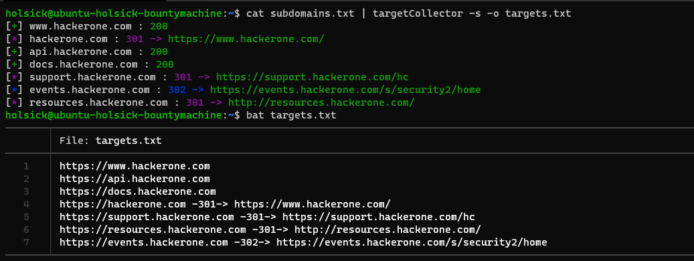

# targetCollector

> A small python script meant to help improve your bug bounty / pentest recon flow
---

### Requirements

Right now, all you should have installed in order for the script to run is the `colorama` module which can be installed using `pip3 install colorama`.

### Basic Usage

> It is recommended to mark the script as executable and add it to your path by simply `chmod +x targetCollector.py && sudo mv targetCollector.py /usr/local/bin/targetCollector`. Once it is added to your path, you are ready to start piping your domain lists into the script for easier and more organized recon.

```bash
Usage:

[*] python3 targetCollector.py -w /path/to/wordlist -o targets.txt
[*] targetCollector -w /path/to/wordlist -s -o targets.txt
[*] amass enum -d example.com -o subdomains.txt && cat subdomains.txt | targetCollector -s -o targets.txt


Options:
  -h, --help            show this help message and exit
  -w WORDLIST, --wordlist=WORDLIST
                        File containing a list of subdomains -- (sub-
                        domain.example.com)
  -s, --silent          Only show live domains
  -o OUTFILE, --outfile=OUTFILE
                        File to write target list to
  -t TIMEOUT, --timeout=TIMEOUT
                        http request timeout value (specify float value eg.
                        3.0)
```


### Improvements

**Please do let me know how I can improve this script! I would ideally like it to be much faster while also yielding accurate results.**
**Plenty of room for improvement!**
